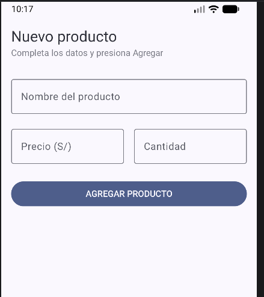
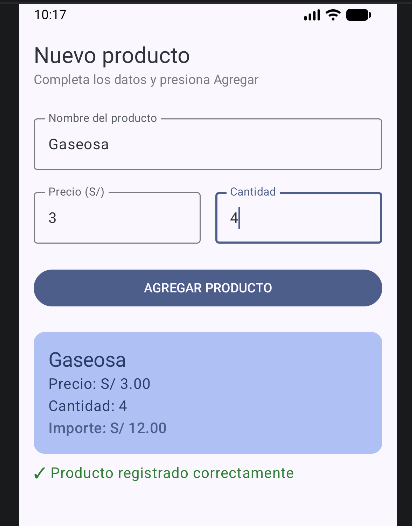

Lab03 - Registro de Producto (Jetpack Compose)

**Autor:** Piero Guevara
**Curso:** Programación en Móviles 
**Sección:** C24-C

Pantalla de registro de producto con Jetpack Compose: campos de nombre,
precio y cantidad con estado (OutlinedTextField), botón para agregar y
Card de resumen con el importe calculado.

Capturas:

¿Qué pasa si declaras las variables SIN remember?

Al quitar remember, probé escribir en el campo de nombre y no me dejaba, tecleaba algo
y simplemente no aparecia. Entendí que sin remember, Compose no guarda el valor entre 
recomposiciones cada vez que la pantalla se redibuja, la variable vuelve a su estado inicial 
vacío. Con remember sí "recuerda" lo que había antes de redibujar, por eso el campo funciona.